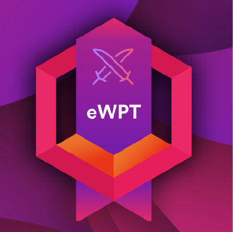

# eWPT — Web Application Penetration Tester 🎯

<div align="center">


**[🏆 Verify My Certification](https://certs.ine.com/31cfdcf7-a030-4fd4-afaf-ce07fc7175d3#acc.7Sxvg4WE)**

</div>

---

## 📌 What is eWPT?

The **eWPT (eLearnSecurity Web Application Penetration Tester)** is a
professional, hands-on certification issued by **INE/eLearnSecurity**
that validates real-world skills in web application penetration testing.

Unlike multiple-choice exams, eWPT is a **fully practical exam** where
candidates must perform a complete penetration test against a real
web application environment and submit a professional report.

---

## 👥 Who is it For?

| Profile | Why eWPT? |
|---------|-----------|
| 🔐 **Aspiring Pentesters** | First professional web security cert |
| 💻 **Web Developers** | Understand how their apps get attacked |
| 🛡️ **Security Analysts** | Expand into offensive security |
| 🎓 **Students** | Bridge gap between theory and practice |
| 🔄 **OSCP Candidates** | Solid web security foundation |

---

## 🗺️ Certification Domains & Objectives

### 1️⃣ Web Application Penetration Testing Processes and Methodologies `10%`

> Understanding industry-standard methodologies for web app testing

- ✅ Accurately assess a web application based on methodological,
  industry-standard best practices
- ✅ Identify vulnerabilities in web applications in accordance with
  the OWASP Web Security Testing Guide

---

### 2️⃣ Information Gathering & Reconnaissance `10%`

> Passive and active recon techniques to map the target

- ✅ Extract information from websites using passive reconnaissance
  & OSINT techniques
- ✅ Extract information about a target organization's domains,
  subdomains, and IP addresses
- ✅ Examine Web Server Metafiles for information exposure

---

### 3️⃣ Web Application Analysis & Inspection `10%`

> Understanding the target's technology stack and structure

- ✅ Identify the type and version of a web server technology
  running on a given domain
- ✅ Identify the specific technologies or frameworks being used
  in a web application
- ✅ Analyze the structure of web applications to identify
  potential attack vectors
- ✅ Locate hidden files and directories not accessible through
  normal browsing
- ✅ Identify and exploit vulnerabilities caused by the improper
  implementation of HTTP methods

---

### 4️⃣ Web Application Vulnerability Assessment `15%`

> Finding and validating common web vulnerabilities

- ✅ Identify and exploit common misconfigurations in web servers
- ✅ Test web applications for default credentials and weak passwords
- ✅ Bypass weak/broken authentication mechanisms
- ✅ Identify information disclosure vulnerabilities

---

### 5️⃣ Web Application Security Testing `25%`

> The core of the exam — hands-on exploitation

- ✅ Identify and exploit directory traversal vulnerabilities
  for information disclosure
- ✅ Identify and exploit file upload vulnerabilities
  for remote code execution
- ✅ Identify and exploit Local File Inclusion (LFI) and
  Remote File Inclusion (RFI) vulnerabilities
- ✅ Identify and exploit Session Management vulnerabilities
- ✅ Exploit vulnerable and outdated web application components
- ✅ Perform bruteforce attacks against login forms
- ✅ Identify and exploit command injection vulnerabilities
  for remote code execution

---

### 6️⃣ Manual Exploitation of Common Web Application Vulnerabilities `20%`

> Deep-dive manual exploitation techniques

- ✅ Identify and exploit Reflected XSS vulnerabilities
- ✅ Identify and exploit Stored XSS vulnerabilities
- ✅ Identify and exploit SQL Injection vulnerabilities
- ✅ Identify and exploit vulnerabilities in content management systems
- ✅ Extract information and credentials from backend databases

---

### 7️⃣ Web Service Security Testing `10%`

> Modern API and web service attack techniques

- ✅ Identify and enumerate information from web services
- ✅ Exploit vulnerable web services

---

## 🧰 Tools & Resources

> See detailed cheat sheet → [ewpt-cheat-sheet.md](./ewpt-cheat-sheet.md)

> Full preparation roadmap → [roadmap-exam-preparation.md](./roadmap-exam-preparation.md)

---

## 💡 My Tips for the Exam

```
1. Enumerate EVERYTHING before you exploit anything
2. Always check HTTP methods (OPTIONS, PUT, DELETE)
3. Default credentials are your best friend in labs
4. Read page source code carefully — comments hide secrets
5. Check robots.txt, sitemap.xml, and .htpasswd
6. OWASP WSTG is your bible during the exam
7. Document findings as you go — report writing matters!
8. Don't overlook cookies and session management
9. Always try directory traversal on file parameters
10. If stuck — go back to enumeration
```

---


## ⚠️ Disclaimer

> All penetration testing activities were performed in
> authorized lab environments provided by INE/eLearnSecurity.
> Never perform security testing without explicit written permission.

---
